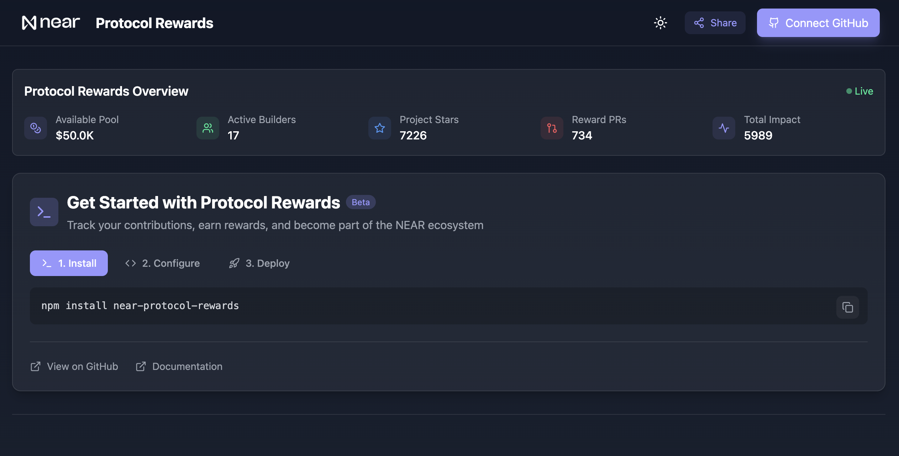

# NEAR Protocol Rewards SDK

> A transparent, metric-based rewards system for NEAR projects that directly ties incentives to development activity.

<div align="center">
  
  [](https://www.npmjs.com/package/near-protocol-rewards)
  [](https://www.typescriptlang.org/)
  [](https://opensource.org/licenses/MIT)
  [](https://github.com/jbarnes850/near-protocol-rewards/blob/main/CONTRIBUTING.md)

</div>

## What is Protocol Rewards?

Protocol Rewards is a developer-first funding solution for the NEAR ecosystem. We're solving a critical challenge in Web3: how to sustainably fund and reward developers building high-impact projects.

### The Problem

- Traditional funding models (grants, VCs) require extensive time spent on proposals and pitches
- Developers want to focus on building, not fundraising
- Project impact is often measured subjectively
- Funding is typically front-loaded rather than tied to ongoing development

### Our Solution

Protocol Rewards provides:

- Automated tracking of development metrics and project impact
- Merit-based rewards tied directly to contributions
- Transparent, objective criteria for funding
- Sustainable, ongoing rewards that scale with project growth

By automating the entire process from tracking to distribution, we enable developers to focus on what they do best - building innovative solutions on NEAR.

## Documentation

- [Quick Start Guide](https://github.com/jbarnes850/near-protocol-rewards/blob/main/docs/quick-start.md)
- [Architecture Overview](https://github.com/jbarnes850/near-protocol-rewards/blob/main/docs/architecture.md)

## Dashboard

While this SDK handles the collection and processing of development metrics, the [NEAR Protocol Rewards Dashboard](https://github.com/jbarnes850/protocol-rewards-dashboard) provides the visualization and storage layer. The dashboard offers:

- 📊 Real-time visualization of developer activity and metrics
- 💾 Persistent storage of historical contribution data
- 📈 Analytics and insights for project maintainers
- 🏆 Reward distribution and tracking interface



View your project's metrics and manage rewards on our [dashboard platform](https://github.com/jbarnes850/protocol-rewards-dashboard).

## Installation

```bash
npm install near-protocol-rewards
```

## Quick Start

```typescript
import { NEARProtocolRewardsSDK } from 'near-protocol-rewards';

const sdk = new NEARProtocolRewardsSDK({
  githubRepo: 'org/repo',
  githubToken: process.env.GITHUB_TOKEN,
  timeframe: 'week'  // 'day' | 'week' | 'month'
});

// Start tracking metrics
await sdk.startTracking();

// Listen for metrics updates
sdk.on('metrics:collected', (metrics) => {
  console.log('New metrics:', {
    commits: metrics.github.commits.count,
    prs: metrics.github.pullRequests.merged,
    reviews: metrics.github.reviews.count,
    issues: metrics.github.issues.closed
  });
});

// Handle errors
sdk.on('error', (error) => {
  console.error('Error:', error);
});
```

## Configuration

```typescript
interface SDKConfig {
  // Required
  githubRepo: string;          // GitHub repository in "owner/repo" format
  githubToken: string;         // GitHub personal access token

  // Optional
  timeframe?: 'day' | 'week' | 'month';  // Default: 'week'
  logLevel?: 'debug' | 'info' | 'warn' | 'error';  // Default: 'info'
  maxRequestsPerSecond?: number;  // Default: 5

  // Optional: Validation rules
  validation?: {
    github?: {
      minCommits?: number;
      maxCommitsPerDay?: number;
      minAuthors?: number;
    }
  };

  // Optional: Metric weights
  weights?: {
    commits?: number;      // Default: 0.35
    pullRequests?: number; // Default: 0.25
    reviews?: number;      // Default: 0.20
    issues?: number;       // Default: 0.20
  }
}
```

## Error Handling

The SDK uses a comprehensive error system:

```typescript
sdk.on('error', (error) => {
  if (error.code === 'RATE_LIMIT_ERROR') {
    // Handle rate limiting
  } else if (error.code === 'VALIDATION_ERROR') {
    // Handle validation errors
  }
});
```

## Development

```bash
# Install dependencies
npm install

# Setup environment
cp .env.test.example .env.test    # Copy and configure your test environment
```

For local development and testing:
- Unit tests: `npm run test:unit` (no environment setup needed)
- Integration tests: Configure `.env.test` with your GitHub token and run `SKIP_INTEGRATION_TESTS=false npm test`

## Contributing

We welcome contributions! Please see our [Contributing Guide](https://github.com/jbarnes850/near-protocol-rewards/blob/main/CONTRIBUTING.md).

## License

MIT © [NEAR Protocol](https://github.com/jbarnes850/near-protocol-rewards/blob/main/LICENSE)
